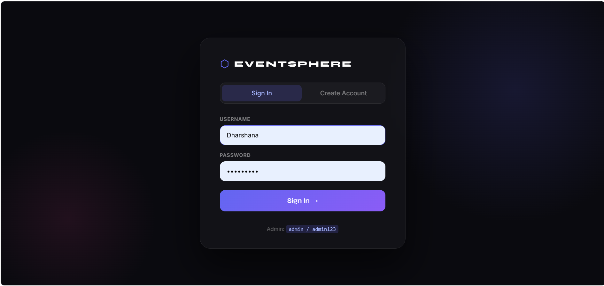
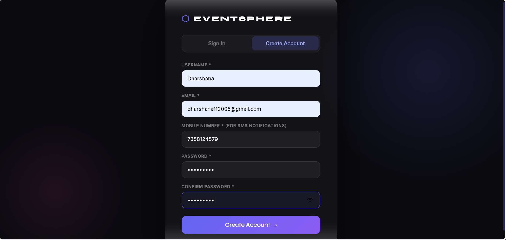
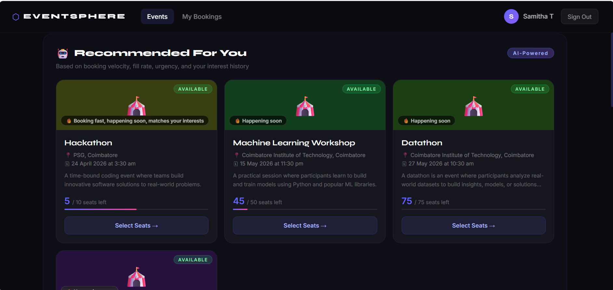
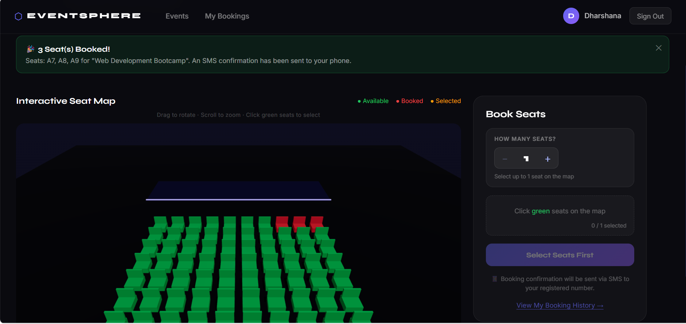
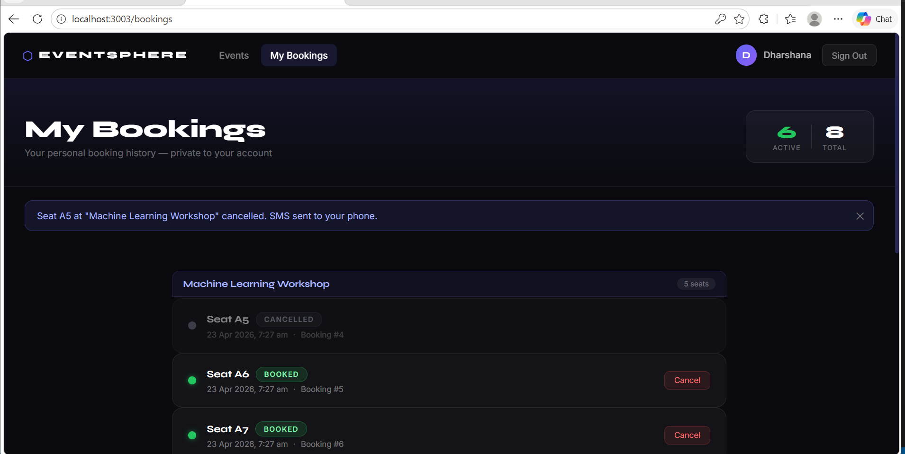

# ⬡ EventSphere — 3D Event Booking System

A production-grade full-stack event booking platform featuring an **interactive 3D seat selection** interface, role-based access control, and complete booking lifecycle management.

---

## 📸 Screenshots

### Login Page


### Admin Dashboard


### Events Page


### 3D Seat View


### My Bookings


---

## 🏗️ Architecture

```
event-booking/
├── backend/                    # FastAPI Python backend
│   ├── main.py                 # App entry point, CORS, route registration
│   ├── conftest.py             # Pytest path setup
│   ├── pytest.ini              # Test configuration
│   ├── requirements.txt
│   ├── db/
│   │   └── database.py         # SQLAlchemy engine + session factory
│   ├── models/
│   │   └── models.py           # ORM: Event, Seat, Booking + Enums
│   ├── schemas/
│   │   └── schemas.py          # Pydantic v2 request/response models
│   ├── services/
│   │   ├── event_service.py    # Event CRUD + auto seat generation
│   │   └── booking_service.py  # Book/cancel with conflict prevention
│   ├── api/
│   │   ├── auth.py             # POST /auth/login
│   │   ├── events.py           # Events + Seats routes
│   │   └── bookings.py         # Booking routes
│   └── tests/
│       └── test_bookings.py    # 6 unit tests
│
├── frontend/                   # React 18 frontend
│   ├── public/index.html
│   └── src/
│       ├── App.js              # Router + auth guards
│       ├── App.css             # Global reset + scrollbar
│       ├── index.js
│       ├── api/
│       │   └── client.js       # Axios API wrapper
│       ├── context/
│       │   └── AuthContext.js  # Session-based auth state
│       ├── components/
│       │   ├── Navbar.js/.css  # Persistent navigation bar
│       │   └── SeatViewer3D.js # Three.js 3D seat map component
│       └── pages/
│           ├── Login.js/.css
│           ├── Admin.js/.css
│           ├── Events.js/.css
│           ├── EventDetail.js/.css
│           └── Bookings.js/.css
│
├── sdk_sample.py               # Generated SDK usage example
├── setupdev.bat / .sh          # One-click environment setup
└── runapplication.bat / .sh    # One-click application launcher
```

---

## ⚙️ Setup Instructions

### Prerequisites
- Python 3.10+
- Node.js 18+
- npm 9+

### Windows (One-click)
```bat
setupdev.bat
runapplication.bat
```

### Linux / macOS (One-click)
```bash
chmod +x setupdev.sh runapplication.sh
./setupdev.sh
./runapplication.sh
```

### Manual Setup
```bash
# Backend
cd backend
python3 -m venv venv
source venv/bin/activate          # Windows: venv\Scripts\activate
pip install -r requirements.txt
uvicorn main:app --reload --port 8000

# Frontend (new terminal)
cd frontend
npm install
npm start
```

---

## 🌐 URLs

| Service | URL |
|---|---|
| Frontend | http://localhost:3000 |
| Backend API | http://localhost:8000 |
| Swagger UI | http://localhost:8000/docs |
| ReDoc | http://localhost:8000/redoc |
| OpenAPI JSON | http://localhost:8000/openapi.json |

---

## 🔐 Demo Credentials

| Role | Username | Password |
|---|---|---|
| Admin | `admin` | `admin123` |
| User | `alice` | `alice123` |
| User | `bob` | `bob123` |
| User | `user1` | `user123` |
| User | `user2` | `user123` |

---

## 📡 API Documentation

### Auth
| Method | Endpoint | Description |
|---|---|---|
| POST | `/auth/login` | Authenticate, returns role |

### Events
| Method | Endpoint | Description |
|---|---|---|
| POST | `/events` | Create event (auto-generates seats) |
| GET | `/events?search=` | List all events, optional name filter |
| GET | `/events/{id}` | Get event details |
| GET | `/events/{id}/seats` | Get all seats for event |

### Bookings
| Method | Endpoint | Description |
|---|---|---|
| POST | `/events/{id}/book` | Book a seat |
| DELETE | `/bookings/{id}` | Cancel booking (status → CANCELLED) |
| GET | `/bookings/{username}` | Get booking history for user |

### Example: Create Event
```json
POST /events
{
  "name": "Rock Night 2025",
  "description": "Epic rock concert at the beachfront",
  "location": "Marina Beach Arena, Chennai",
  "total_seats": 50,
  "date": "2025-12-20T19:30:00"
}
```

### Example: Book a Seat
```json
POST /events/1/book
{
  "seat_id": 7,
  "user_name": "alice",
  "mobile_number": "9876543210"
}
```

### Example Response
```json
{
  "id": 1,
  "event_id": 1,
  "seat_id": 7,
  "user_name": "alice",
  "mobile_number": "9876543210",
  "booking_date": "2025-06-01T14:23:00",
  "status": "BOOKED",
  "seat_number": "A7",
  "event_name": "Rock Night 2025"
}
```

---

## 🧪 Running Tests

```bash
cd backend
source venv/bin/activate   # Windows: venv\Scripts\activate
pytest tests/ -v
```

### Test Coverage
| Test | What it validates |
|---|---|
| `test_successful_booking` | Full booking flow, correct response fields |
| `test_booking_already_booked_seat` | 409 Conflict on duplicate seat booking |
| `test_cancellation_updates_status` | Status → CANCELLED, seat freed, history preserved |
| `test_double_cancellation_fails` | 409 on cancelling an already-cancelled booking |
| `test_event_available_seats_decrements` | Counter decrements correctly on booking |
| `test_booking_history_sorted_by_date` | Latest bookings returned first |

---

## 🎮 3D Seat Viewer

The seat viewer uses **react-three-fiber** (React wrapper for Three.js):

- Each seat is a **3D box geometry** with a seat-back mesh
- **Color coding**: Green=AVAILABLE · Red=BOOKED · Gold=SELECTED
- **Hover animation**: seats lift and glow on mouse-over
- **Click interaction**: clicking an available seat selects it for booking
- **OrbitControls**: drag to rotate, scroll to zoom, right-drag to pan
- **Atmospheric lighting**: purple/pink/cyan point lights + directional shadow
- **Stage**: labeled stage platform at the front of the seating area
- **Seat labels**: each cube displays its seat number (A1, B3, etc.)

---

## ⚡ SDK Generation

With the backend running:

```bash
# Install generator
npm install @openapitools/openapi-generator-cli -g

# Generate Python SDK
openapi-generator-cli generate \
  -i http://localhost:8000/openapi.json \
  -g python \
  -o event_sdk \
  --additional-properties=packageName=event_sdk

# Install SDK
cd event_sdk && pip install -e .

# Run sample
python sdk_sample.py
```

See `sdk_sample.py` for full annotated usage.

---

## 🗄️ Database Schema

```sql
-- Events table
CREATE TABLE events (
  id             INTEGER PRIMARY KEY,
  name           TEXT NOT NULL,
  description    TEXT,
  location       TEXT NOT NULL,
  total_seats    INTEGER NOT NULL,
  available_seats INTEGER NOT NULL,
  date           DATETIME NOT NULL,
  created_at     DATETIME DEFAULT CURRENT_TIMESTAMP
);

-- Seats table (auto-generated on event creation)
CREATE TABLE seats (
  id          INTEGER PRIMARY KEY,
  event_id    INTEGER REFERENCES events(id),
  seat_number TEXT NOT NULL,   -- e.g. A1, A2, B1 ...
  status      TEXT DEFAULT 'AVAILABLE'  -- AVAILABLE | BOOKED
);

-- Bookings table (never deleted, only status updated)
CREATE TABLE bookings (
  id            INTEGER PRIMARY KEY,
  event_id      INTEGER REFERENCES events(id),
  seat_id       INTEGER REFERENCES seats(id),
  user_name     TEXT NOT NULL,
  mobile_number TEXT NOT NULL,
  booking_date  DATETIME DEFAULT CURRENT_TIMESTAMP,
  status        TEXT DEFAULT 'BOOKED'  -- BOOKED | CANCELLED
);
```

---

## 🔥 Business Logic Guarantees

- ✅ Seats auto-generated on event creation (A1–Z10 labeling)
- ✅ Double-booking prevented at service layer (409 Conflict)
- ✅ `available_seats` counter decremented on book, incremented on cancel
- ✅ Bookings **never deleted** — status set to CANCELLED
- ✅ Full booking history maintained per user
- ✅ Proper HTTP status codes (201, 404, 409, 401)
- ✅ Transaction-safe updates (SQLAlchemy session commit)

---

## 🛠️ Tech Stack

| Layer | Technology |
|---|---|
| Backend Framework | FastAPI 0.111 |
| Database | SQLite + SQLAlchemy 2.0 |
| Validation | Pydantic v2 |
| Server | Uvicorn (ASGI) |
| Frontend | React 18 + React Router v6 |
| 3D Engine | Three.js + @react-three/fiber + @react-three/drei |
| HTTP Client | Axios |
| Testing | Pytest + HTTPX TestClient |
| API Docs | OpenAPI 3 (Swagger UI built-in) |
| SDK | OpenAPI Generator CLI |

---

*Built as a real-world mini product — not just a basic assignment.*
